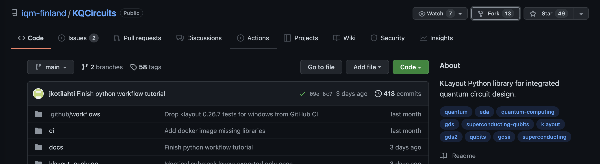

# Preparation

In order to successfully participate in this challenge, you will need to install a couple of programs/frameworks on your notebook.

## KQCircuits

### GUI Version

We will work with a software package called KQCircuits that builds upon KLayout. You can find more details on how to install KQCircuits in the docs:
[https://iqm-finland.github.io/KQCircuits/start/installation.html](https://iqm-finland.github.io/KQCircuits/start/installation.html)

Please follow the instructions to install KLayout together with KQCircuits.

### Developer Version

Besides installing the standard version, there is also a developer version that will help you dig deeper!
In order to run this version, you will need a couple of tools!

First, you need to make sure that you have the following things prepared.

KQCircuits installation requires Python 3, which should be already installed on Linux. On Windows you may have to install it. If your Python installation does not already contain the pip package manager, you have to also install that.

Successfully tested versions:

- Ubuntu 18.04 and 20.04 LTS with Python 3.6.9 and Python 3.8.5
- Windows: Python 3.7.6, 3.8.5

To be prepared for the challenge ahead, please ensure to follow this steps:

- Check if Python is installed.
- Install Python if needed ([Windows](https://realpython.com/installing-python/), should be )
- Install [git](https://git-scm.com/) (pre-installed on most Linux distros; for Mac install developer-tools)
- If you don't have an account, create a [GitHub account](https://github.com/)
- Fork KQCircuits with your Github account via the fork button (you need to be logged into your GitHub account).
  

After that you can clone your KQCircuit fork locally and start hacking with the following commands.
Pay attention: You need to change <your_user_name> in the first line with your actual GitHub user name.

```
git clone https://github.com/<your_user_name>/KQCircuits
cd KQCircuits
python3 setup_within_klayout.py
```

You will find more details on how to proceed here: [https://iqm-finland.github.io/KQCircuits/developer/setup.html](https://iqm-finland.github.io/KQCircuits/developer/setup.html)
